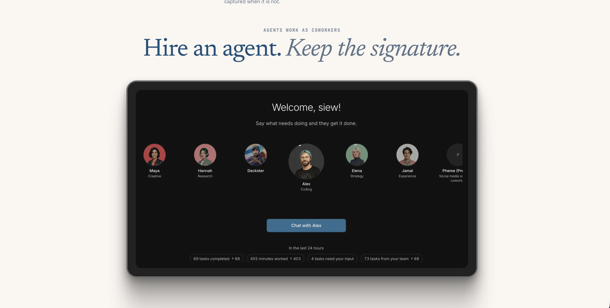

# Claudia

The human authority layer for AI agents. Give your agents an allowance, not your keys.

[](https://claudiahq.vercel.app)

Agents are infinite. Human attention is not. Claudia is the human authority layer for AI agents. It sits between an AI agent and consequential execution: the agent proposes, a deterministic engine checks the proposal against a mandate, external facts are verified, and funds move only for the exact action a human signed. Interrupting that human costs the agent a bond.

- Site: https://claudiahq.vercel.app
- Pitch deck: https://docs.google.com/presentation/d/14bCEjvkdXQAikaajeXOhlg5EjZV6KWgD/edit?usp=sharing
- Agent: Human Authority Endpoint, a Masumi MIP-003 service registered on Cardano preprod ([registration tx](https://preprod.cardanoscan.io/transaction/fea9e74b95cc0ed76adbbdcd81f1bfd46276cf35c7dc976b2dff48208e32b1f8))

## What it is

AI agents are starting to pay invoices. A spending-limit credential says who can act, not whether this exact payment is allowed. Claudia sits between the agent and the money: the agent proposes, a deterministic engine decides against a mandate, and only the human's signature moves funds.

Every proposal ends in one word:

- ALLOW: inside the mandate and below the agent's limit. Verified, signed by the engine, settled by the vault.
- ESCALATE: above the agent's limit. The agent gets HTTP 402 and locks a 5 ADA bond in Cardano escrow before a person is interrupted. A reasonable ask is refunded; a frivolous one is captured to an unspendable sink.
- DENY: outside the mandate, facts do not match, or the interrupt budget is spent. Nothing moves and nobody is paged.

## How it works

1. The agent signs an Action IR (what, how much, to whom, why, under which mandate) and calls `POST /v1/authority/check`.
2. The engine checks it against the mandate: vendors, per-action limit, daily cap, treasury floor, interrupt budget.
3. A Chainlink CRE workflow fetches the invoice facts and writes a report to a Sepolia registry. The engine reads it back and checks its hash.
4. On ESCALATE the agent pays the bond over x402 headers (`PAYMENT-REQUIRED`, `PAYMENT-SIGNATURE`, `PAYMENT-RESPONSE`).
5. The human reads a Decision Brief and signs with a Cardano wallet (CIP-30) on their own device.
6. The Aiken vault releases exactly what was signed. The receipt binds action, facts, brief and signature, and anyone can recompute it in the browser.

## Built with

- Cardano preprod: Aiken validators for the mandate anchor, treasury vault and escalation bond escrow.
- Chainlink CRE: two TypeScript workflows, invoice verification and FX basis from the BRL/USD data feed, writing to Sepolia registries.
- Masumi and Sokosumi: the Human Authority Endpoint, 1 tUSDM per evaluation.
- x402 transport with a Cardano escrow scheme.
- TypeScript pnpm monorepo, Next.js, Postgres hash-chained event log.

## On-chain proof

- Bond refunded: [29cd8f8c...](https://preprod.cardanoscan.io/transaction/29cd8f8ce51ee103f3c3c57a912fa4573f7084d905f54e47843d53a930c1ecae)
- Bond captured to the sink: [cd77ade3...](https://preprod.cardanoscan.io/transaction/cd77ade3de312471ac725ef8f0f31ba53ab00fd640e491946d4de974e6fcd88e)
- Vault minted: [ab5b303c...](https://preprod.cardanoscan.io/transaction/ab5b303c1c416efaed2d99683d93ba05ef4f494f6b21994767357bf554f1e200)
- Mandate anchored: [fe05f66e...](https://preprod.cardanoscan.io/transaction/fe05f66e17676d1973e3c89de350b5397f43c985a1717cd9698414d9529575ab)
- CRE invoice report on Sepolia: [0x68bdc690...](https://sepolia.etherscan.io/tx/0x68bdc690cf4338f3009f59487ceeaba4ff8a57f237b044be06a5a21abdcdfd98)
- CRE FX attestation on Sepolia: [0x2549899d...](https://sepolia.etherscan.io/tx/0x2549899d0f1884b944320919279ce0ce98539aeaa761b9a210bde332071b78a8)

## Run

Requirements: Node 24+, pnpm. Postgres for the API.

```sh
pnpm install
pnpm -r typecheck && pnpm -r test
pnpm --filter @authority/web dev      # the site and console, recorded data, no backend needed
```

Full stack: copy `.env.example` to `.env`, fill the values locally, then start `@authority/api`, `@authority/agent` and `@authority/web`. Preprod scripts live in `scripts`.

## Layout

| Path | Role |
|---|---|
| `packages/core` | Mandate, Action IR, engine, authorization bytes, Decision Brief |
| `contracts/cardano` | Aiken validators: mandate anchor, vault, bond escrow, sink |
| `contracts/sepolia` | Verification and FX registries |
| `workflows` | Chainlink CRE workflows |
| `apps/api` | Authority API: check, 402 gate, approvals, receipts, metrics |
| `apps/agent` | Agent runtime that proposes actions and pays bonds |
| `apps/web` | Site, console, live replay, receipts |
| `apps/masumi-worker` | Masumi MIP-003 worker for the Human Authority Endpoint |
| `packages/*` | Cardano, Chainlink, database, model and Masumi clients |
